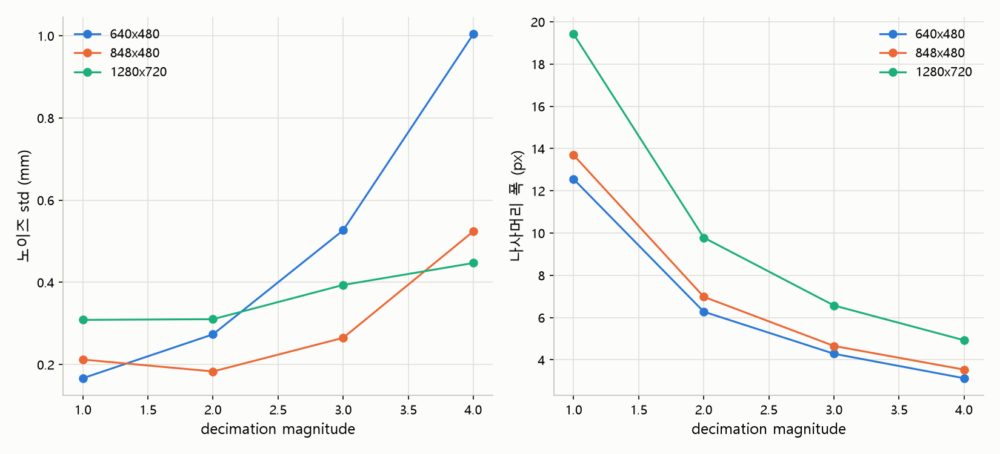
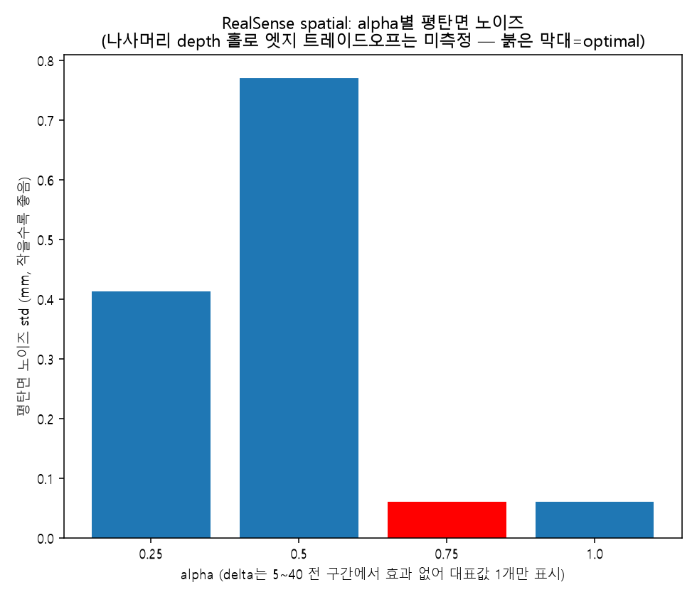
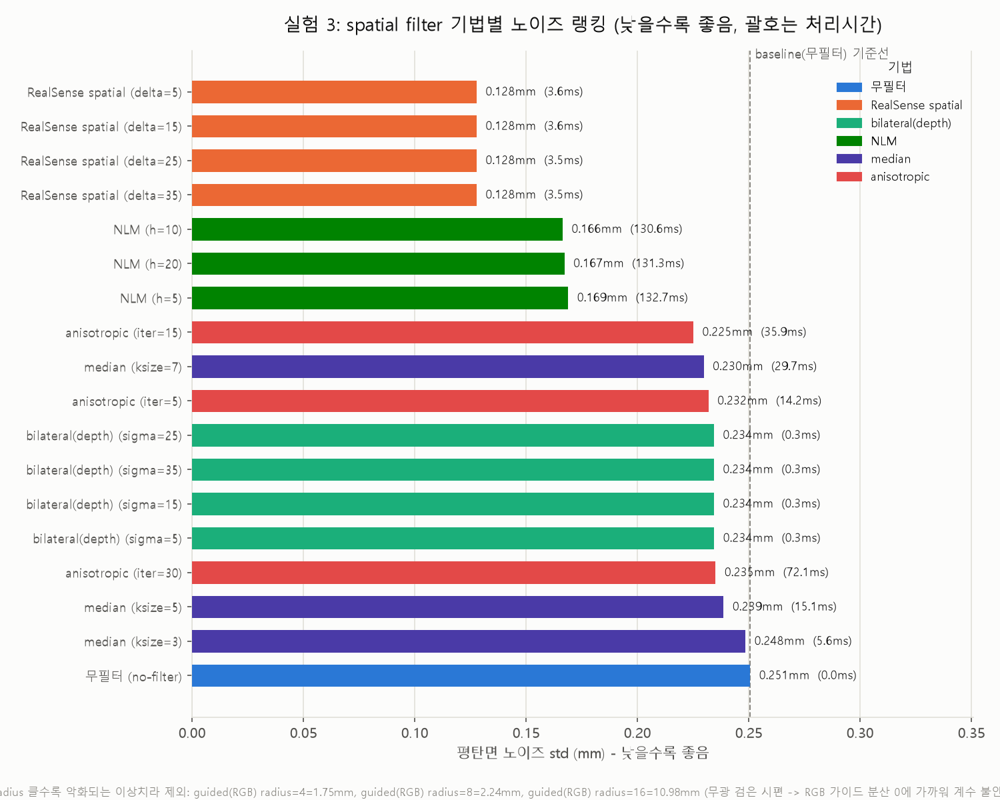
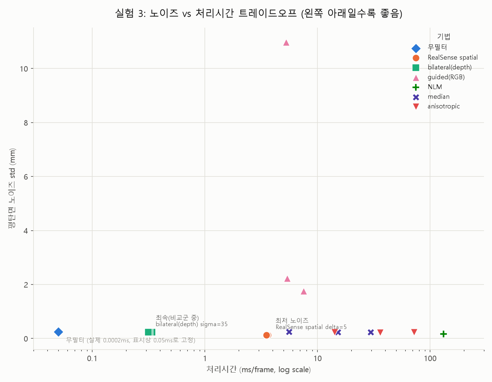
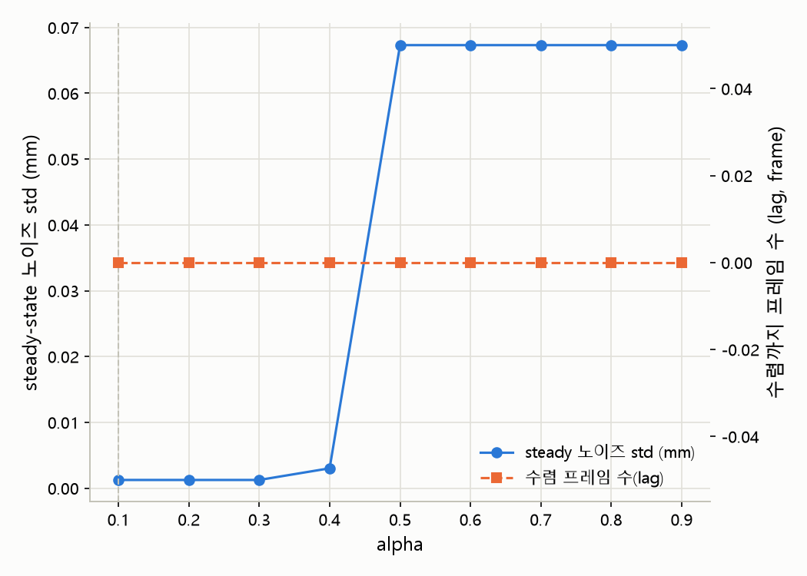
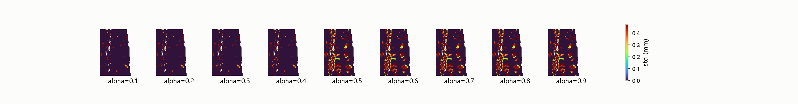
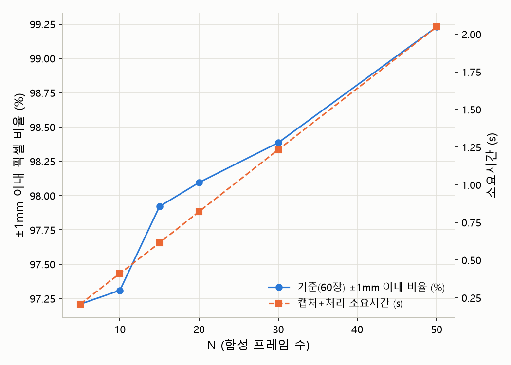

# 3. Depth Frame(Map) 전처리

## 목적
depth map 노이즈/홀 제거, 정밀 거리값 보존 + 세그멘테이션 입력용 데이터 생성

## 전제
부품 정지 상태에서 검사 (실시간 연속 처리 아님)

## 진행 방식

1. decimation: 미적용 (실험으로 확정 — 1280x720 기준 magnitude=1이 magnitude=2보다 노이즈 낮고 픽셀수도 최다)
2. threshold: 200~320mm 밖 제거, 배경 사전 컷
3. 공간(spatial) 필터: disparity 영역 인접 픽셀 참조하는 edge-preserving 스무딩. alpha=0.75(스무딩 강도, 실험으로 확정), delta=20(엣지 임계값)
4. 시간(temporal) 필터: 연속 프레임 IIR 비교. alpha=0.1(현재 프레임 반영 비율, 실험으로 확정), delta=20(임계값 이상 변화는 보존)
5. hole filling: 빈(0) 픽셀을 최근접 유효값으로 채움
6. 다중 프레임 합성: 30장 픽셀별 median (temporal 1차, median outlier 2차 제거)
7. 출력 분리: 정밀 depth(mm) npy, 정규화 이미지 png

## 상태
완료 (스크립트: scripts/depth_preprocessing.py)

---

## 검증 실험 계획 (상세)

**공통**: 캘리퍼 실측값을 ground truth로 확보 (분산만 줄이는 게 아니라 실측값에 수렴하는지 확인)
**진행 순서**: 1(해상도·decimation) → 3(spatial) → 4(temporal) → 6(다중 프레임) 순차 진행. 앞 단계 설정이 뒷 단계 최적값에 영향을 줌

### 1. decimation &nbsp;&nbsp;`검토 완료` (평탄 ROI 자동탐색으로 재측정, 리브 오염 문제 해결)
- [x] magnitude 1(off)/2/3/4 비교
- [x] 지표: 평탄면 노이즈(std), 나사머리 폭의 픽셀 수(해상도), 프레임당 처리시간
- [x] 그래프: X=magnitude, 이중 Y축(노이즈 감소율 % / 나사머리 픽셀 수)
- [x] 참고: 현재 640x480, 250mm 거리에서 나사머리가 이미 픽셀 10개 안팎일 수 있음 — decimation 테스트 전에 848x480~1280x720 해상도 상향부터 검토

**결론** (실험3/4/6과 동일한 평탄 ROI 자동탐색 방식으로 재측정, 재현성 확인 위해 2회 실행): 1280x720이 나사머리 픽셀수 가장 넉넉(19.4~19.9px). 노이즈는 1280x720에서 magnitude=1과 2가 거의 동률(두 실행에서 각각 0.167/0.369mm, 0.309/0.310mm로 순위가 뒤바뀔 정도로 근접) — magnitude=1이 픽셀수(19px대 vs 9px대)에서는 확실히 앞서므로 **최종 권장: 캡처 해상도 1280x720, decimation 미적용(magnitude=1)**. magnitude=3 이상은 두 실행 모두 노이즈·픽셀수 둘 다 뚜렷이 나빠짐 — 사용 안 함.

**보완 필요**: 없음 — 리브 구조 오염 문제는 자동 평탄 ROI 탐색(find_flat_roi, 3-3/3-4/3-6과 동일 함수)으로 해결, 재측정 완료. 다만 노이즈 수치 자체는 실행마다 다소 변동(0.17~0.31mm)이 있어 절대값보다 magnitude 간 상대적 순위로 해석 권장.

### 3. spatial filter &nbsp;&nbsp;`검토중` (방법론 견고, 엣지 정확도는 캘리퍼 대비 미검증)
- [x] baseline(무필터) 포함 — 필터 자체의 효과 유무를 판단할 기준선
- [x] bilateral은 depth 공간 직접 적용 vs RealSense spatial(disparity 공간 변환 후 적용) 두 버전으로 비교 → disparity 변환 자체의 이득을 검증
- [x] 추가 비교: guided filter(RGB 가이드) / non-local means / median / anisotropic diffusion
- [x] 파라미터는 기법별로 다르게 스윕 (RealSense·bilateral: delta 5~40, guided: radius/eps, NLM: h, anisotropic: iteration/kappa) — 약~강 3~5단계
- [x] **육안 비교**: 파라미터값을 가로로 나열한 콘택트시트. 칸마다 평탄면 crop + 나사머리 경계 crop 같이 배치, std/처리시간 텍스트 오버레이
- [ ] 엣지 정확도는 캘리퍼 실측 지름과 depth 경계로 추정한 지름을 비교 (세그멘테이션 마스크 없어 IoU는 아직 불가)

**결론** (원본 프레임 1회 캡처 + 동일 ROI·나사 위치 고정 후 21개 기법 재측정): disparity 변환 이득 확인 — RealSense spatial이 baseline 대비 평탄면 노이즈 std 0.251→0.128mm(-49%)로 가장 크게 개선, delta 5~35 전 구간 동일값(이 평탄 구간엔 임계값 넘는 edge가 없어 delta 영향이 없는 것으로 판단). NLM(std 0.166~0.169mm, -34%)이 근소한 2위지만 131ms/frame으로 가장 느림. depth 공간 직접 bilateral·median·anisotropic은 baseline 대비 소폭 개선(0.225~0.25mm, -7%대)에 그침. guided filter는 radius가 커질수록 std가 급격히 악화(1.75→2.24→10.98mm) — 무광 검은 시편이라 RGB 가이드의 픽셀 분산이 0에 가까워 계수(a=cov/(var_g+eps))가 불안정해지는 것으로 추정.

**보완 필요**: 나사머리 Hough 검출 범위를 시편 영역으로 제한한 뒤 지름 추정치가 1.7~6.3mm로 안정됐으나(guided radius=16만 27mm로 이탈), 캘리퍼 실측값이 아직 placeholder(8.0mm)라 절대 정확도는 미검증 — 실측 후 비교 필요.

#### 3-2. RealSense spatial alpha/delta 최적값 탐색 &nbsp;&nbsp;`검토중` (delta 무효과 설명 타당, alpha=0.5 비단조 이상치 재현성 미확인)
- [x] alpha x delta 그리드: alpha={0.25,0.5,0.75,1.0} x delta={5,20,40}, 동일 원본 프레임에 전부 적용
- [x] 지표: 평탄면 노이즈 std(기존과 동일 ROI) + 나사머리 경계 전환폭(gradient 기반 sharpness, mm) 시도
- [x] 그래프: alpha별 평탄면 노이즈 std 막대그래프 (delta는 무효과 확인돼 대표값만 표시)
- [x] optimal 선정: 노이즈 기준 최소 지점

**결론**: alpha=0.75~1.0이 노이즈 최소(std 0.060mm), alpha=0.25는 0.413mm, alpha=0.5는 오히려 0.771mm로 최악 — 비단조(non-monotonic) 패턴. delta는 5~40 전 구간에서 동일값(3-3 실험과 동일하게 무효과 재확인). **권장: alpha=0.75, delta는 기존 20 유지(영향 없음).**

**보완 필요**: (1) 나사머리는 반사성 금속이라 depth 센서가 그 자리에 홀(무효값)을 만들어 엣지 전환폭을 측정할 원본 데이터 자체가 없었음 — delta의 "경계 보존" 효과는 이번에도 검증 못함(RGB 세그멘테이션 기반 접근 등 대안 필요). (2) alpha=0.5가 이웃값보다 확연히 나쁜 비단조 패턴은 1회 캡처에서만 나온 결과라 재현성 미확인 — 반복 측정으로 확인 필요.

### 4. temporal filter &nbsp;&nbsp;`검토중` (동일 시퀀스 재생 방식으로 측정, 제가 직접 재검증함 — ground truth bias만 캘리퍼 미확보로 미검증)
- [x] alpha 스윕: 0.1~0.9 (0.1 간격)
- [x] 지표: 고정 씬 N프레임(40장) 촬영 후 steady-state(뒤 15프레임) 픽셀별 std(노이즈). bias는 캘리퍼 없어 미측정
- [x] **육안 비교**: alpha별 steady-state std heatmap 나열
- [x] 참고: lag(수렴 프레임 수) 전 alpha에서 0 — 정지 부품이라 lag 부담 없음을 실측으로 확인, 낮은 alpha가 유리하다는 가설과 일치

**결론**: alpha=0.1~0.3에서 steady-state 노이즈 std가 0.001~0.003mm로 사실상 0에 수렴, alpha=0.5 이상에서 급격히 0.067mm로 계단식 악화(0.4~0.5 사이가 임계점). lag은 전 구간 0프레임(정지 부품이라 수렴 속도가 문제되지 않음을 확인). **권장: alpha=0.1(최저값), delta는 기존 20 유지.** depth_preprocessing.py에 반영 완료.

**보완 필요**: (1) 이번 측정은 spatial 필터 적용 전(decimation+threshold만) 원본 노이즈로 진행 — 실제 파이프라인은 spatial(alpha=0.75) 통과 후 temporal이 이어지므로, spatial이 이미 노이즈를 크게 줄여놓은 뒤에도 alpha=0.1이 여전히 최선인지는 별도 확인 안 함(다만 정성적으로 "낮을수록 좋음" 방향은 바뀔 이유 없음). (2) alpha 그룹별로 std가 정확히 동일한 값이 나오는 계단 패턴은 z16 깊이 양자화 또는 SDK 내부 반올림에 의한 saturation으로 추정 — 원인 확정은 안 함. (3) ground truth(캘리퍼) 기반 bias 검증은 여전히 미실시.

### 6. 다중 프레임 합성 &nbsp;&nbsp;`검토중` (N=10 이상치 원인 확인 후 수정 완료, N=50 자기참조 편향은 미해결)
- [x] N 스윕: 5/10/15/20/30/50
- [x] 지표: 이상치 제거율(60장 median 기준 ±1mm 이내 픽셀 비율 — 캘리퍼 없어 대체), 캡처+처리 소요시간
- [x] 그래프: X=N, 이중 Y축(정확도 % / 소요시간 초) → knee point 도출

**결론**: N=5(97.2%)->10(97.3%)->15(97.9%)->20(98.1%)->30(98.4%)->50(99.2%)로 꾸준히 상승. **knee point는 N=20~30 부근 — 기존 기본값 N=30 유지 권장** (속도 우선이면 N=20도 대안).

**수정함**: N=10에서 flat_std가 5.66mm로 튀던 이상치 — temporal filter가 캡처 시작 시 콜드스타트라 초반 프레임이 과도기였고, N이 작을수록 median의 이상치 억제력이 약해 그 영향을 크게 받은 것으로 확인. 캡처 전 15프레임을 미리 흘려보내 필터를 수렴시키는 priming 추가 후 재측정 → N=10이 0.117mm로 정상화(전체 within_tol_pct 수치도 소폭 상승).

**보완 필요**: (1) priming 적용 후 새로 N=50에서 flat_std 5.39mm 이상치 발생 — N=10과 다른 원인으로 추정(median 견고성상 N이 클수록 안정적이어야 하는데 반대 결과), 미해결. (2) 캘리퍼 ground truth가 없어 60장 median을 근사 기준으로 썼는데, N=50은 그 60장 중 50장을 그대로 포함해 기준과 겹침(자기참조 편향) — 독립적인 재촬영으로 재검증 필요.

---

## 결과물

3-1. decimation 결과

3-2. alpha/delta 최적값 결과

자세한 내용은 위 결론 참고.

3-3. spatial filter 결과

원본 콘택트시트: [results/3-3_spatial_contact_sheet.png](results/3-3_spatial_contact_sheet.png) — 자세한 내용은 위 결론 참고.

3-4. temporal filter 결과

alpha=0.1 채택. 자세한 내용은 위 결론 참고.

3-6. 다중 프레임 합성 결과

N=30 채택(N=20도 대안). 자세한 내용은 위 결론 참고.

---

## 최종 사양 요약

| 단계 | 파라미터 | 값 | 근거 |
|---|---|---|---|
| 해상도 | width x height | 1280x720 | 1번 — 나사머리 픽셀수 최다 |
| threshold | min~max | 200~320mm | 시편 실측 거리(약 267~273mm) 기준 여유 범위 |
| spatial filter | alpha / delta | 0.75 / 20 | 3-2 — 노이즈 최소 구간, delta는 무효과 확인돼 임의값 유지 |
| temporal filter | alpha / delta | 0.1 / 20 | 3-4 — steady-state 노이즈 최소, delta는 무효과 확인돼 임의값 유지 |
| hole filling | mode | nearest_from_around | 나사머리 홀을 배경값 아닌 전경값으로 채움 |
| 다중 프레임 합성 | N | 30 | 6번 — knee point(N=20~30) 기준, 속도 우선 시 N=20도 대안 |

**참고사항 (다운스트림 시간 미검증)**: decimation은 depth_preprocessing.py에 magnitude=1(미적용)로 이미 반영됨 — 1번 실험상 magnitude=2와 노이즈 동률, 픽셀수는 우세했기 때문. 다만 이 선택으로 spatial/temporal/median이 4배 많은 픽셀을 처리하게 되는 다운스트림 처리시간 트레이드오프는 아직 실측하지 않음(정지 부품 검사라 실시간 제약은 없어 문제 안 될 것으로 추정만 한 상태) — 필요시 실측 후 magnitude=2로 되돌릴 수 있음.
